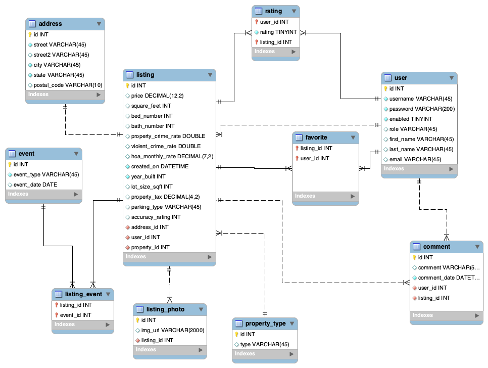

# House Report - CarFax for Houses.
House Report is a data-driven and open-source web application written in Java.

## Developers
#### [Ray Space](https://github.com/ryspc), [Caleb Koch](https://github.com/CKoch92), [Alex Adkins](https://github.com/aadkin200), [Brian Ramirez](https://github.com/gbramirez)

## Overview

## Functionality

## Technologies Used

* [Java](https://en.wikipedia.org/wiki/Java_) 
* [Object-Oriented design](https://stackabuse.com/object-oriented-design-principles-in-java) 
* [Eclipse](https://www.eclipse.org/ide/) 
* [Git](https://git-scm.com/) 
* [Unix Terminal](https://en.wikipedia.org/wiki/Unix_shell) 
* [MySQL](https://www.mysql.com/) 
* [Spring Framework](https://en.wikipedia.org/wiki/Spring_Framework#Spring_Boot) 
* [MVC / Model-View-Controller](https://en.wikipedia.org/wiki/Model%E2%80%93view%E2%80%93controller) 

## How to Run

## Methodology

## Lessons Learned

## EER Diagram

